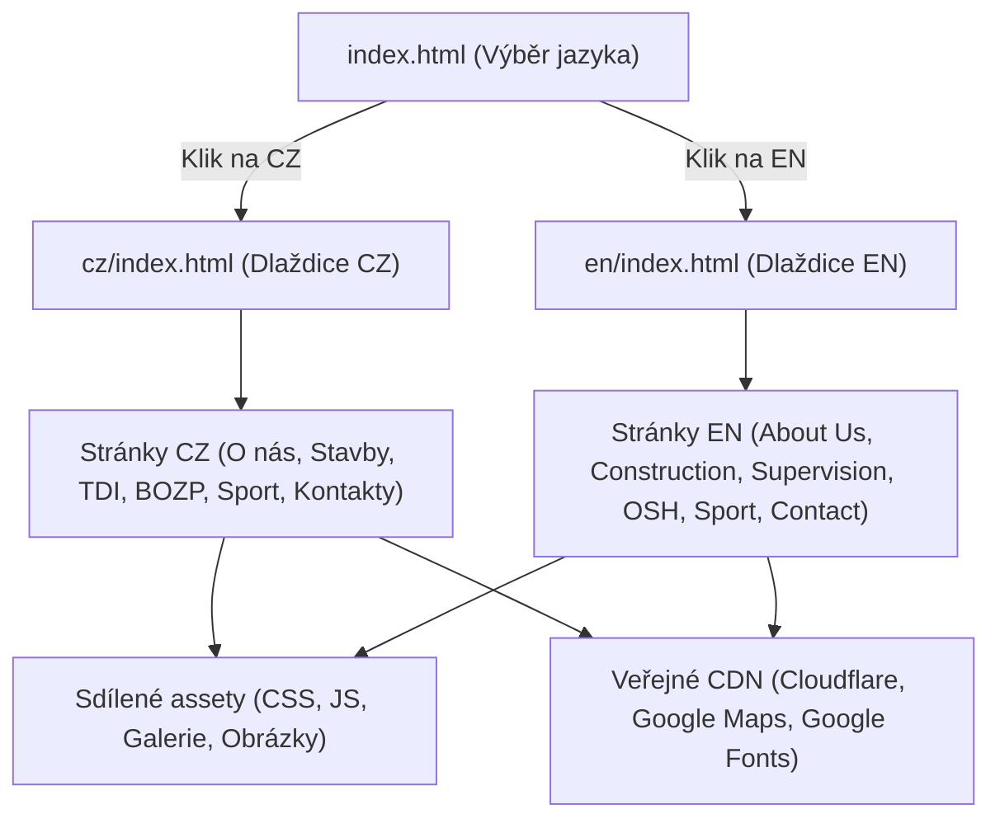

# Requirements

### Overview & Goals
Projekt obsahuje statickou kopii webu staženou pomocí nástroje HTTrack/wget do podadresáře `braincz.cz`. Cílem je projekt analyzovat, identifikovat a odstranit stažené součásti cizích webů a CDN služeb, které byly staženy nedopatřením, nahradit je korektními externími odkazy na CDN a připravit čistou, přehlednou adresářovou strukturu připravenou k nasazení na běžný webhosting.

### Scope
- **In Scope:**
  - Analýza všech adresářů a souborů v projektu.
  - Identifikace a smazání adresářů reprezentujících externí weby a služby (`cdnjs.cloudflare.com`, `maps.google.com`, `ajax.googleapis.com`).
  - Odstranění dočasných/pomocných souborů nástroje HTTrack (`backblue.gif`, `fade.gif`, meta refresh indexy).
  - Úprava odkazů v HTML souborech na oficiální veřejná CDN.
  - Návrh vyčištěné a narovnané adresářové struktury pro webhosting.
  - Kontrola integrity interních odkazů, obrázků a funkčnosti CZ/EN mutací.
- **Out of Scope:**
  - Změna grafického designu nebo obsahu webu.
  - Předělávání webu do CMS nebo jiných technologií (zůstává statický HTML/CSS/JS web).

# Technical Design

### Current Implementation
Při analýze projektu byla zjištěna následující struktura:

1. **Kořenový adresář `braincz.cz/`**:
   - `index.html` – generovaný rozcestník HTTrack s automatickým přesměrováním (`<meta HTTP-EQUIV="Refresh" CONTENT="0; URL=brainsro.cz/index.html">`).
   - `backblue.gif`, `fade.gif` – grafika rozhraní HTTrack.
   - `cdnjs.cloudflare.com/` – lokálně stažená knihovna Gridstack a Lodash.
   - `maps.google.com/` – lokálně stažené fragmenty interních skriptů Google Maps (`common.js`, `util.js`).
   - `brainsro.cz/` – samotný web.

2. **Podadresáře cizích webů nalezené v různých úrovních zanoření**:
   - `braincz.cz/cdnjs.cloudflare.com/`
   - `braincz.cz/maps.google.com/`
   - `braincz.cz/brainsro.cz/metroEN/ajax.googleapis.com/`
   - `braincz.cz/brainsro.cz/metroCZ/webCZ/cdnjs.cloudflare.com/`
   - `braincz.cz/brainsro.cz/metroCZ/webCZ/maps.google.com/`
   - `braincz.cz/brainsro.cz/metroEN/braincom.cz/webEN/cdnjs.cloudflare.com/`
   - `braincz.cz/brainsro.cz/metroEN/braincom.cz/webEN/maps.google.com/`

3. **Struktura samotného webu**:
   - **Vstupní stránka**: `brainsro.cz/index.html` (rozcestník CZ vs ENG).
   - **Česká verze**: `brainsro.cz/metroCZ/index.html` (rozcestník dlaždic) -> odkazuje na stránky v `metroCZ/webCZ/brainsro.cz/` (`A2_KONTAKTY.html`, `C4_BOZP.html`, `E1_O_NAS.html`, `E3_TDI.html`, `F4_SPORT.html`, `G2_STAVBY.html`).
   - **Anglická verze**: `brainsro.cz/metroEN/braincom.cz/index.html` (rozcestník dlaždic) -> odkazuje na stránky v `metroEN/braincom.cz/webEN/brain-com.cz/` (`bozp.html`, `kontakty.html`, `onas.html`, `sport.html`, `stavby.html`, `tdi.html`).

---

### Adresáře navržené ke smazání
Následující adresáře obsahují stažené části cizích webů / CDN, které k webu nepatří a jsou nahraditelné standardními CDN odkazy:

1. `braincz.cz/cdnjs.cloudflare.com`
2. `braincz.cz/maps.google.com`
3. `braincz.cz/brainsro.cz/metroEN/ajax.googleapis.com`
4. `braincz.cz/brainsro.cz/metroCZ/webCZ/cdnjs.cloudflare.com`
5. `braincz.cz/brainsro.cz/metroCZ/webCZ/maps.google.com`
6. `braincz.cz/brainsro.cz/metroEN/braincom.cz/webEN/cdnjs.cloudflare.com`
7. `braincz.cz/brainsro.cz/metroEN/braincom.cz/webEN/maps.google.com`

Dále soubory artefaktů HTTrack:
- `braincz.cz/backblue.gif`, `braincz.cz/fade.gif`
- `braincz.cz/brainsro.cz/metroEN/backblue.gif`, `braincz.cz/brainsro.cz/metroEN/fade.gif`
- `braincz.cz/brainsro.cz/metroEN/index.html` (pouze redirect na `braincom.cz/index.html`)

---

### Key Decisions
1. **Externí knihovny (CDN)**:
   - Lokálně stažené soubory z `cdnjs.cloudflare.com` nahradit přímými odkazy na HTTPS CDN (`https://cdnjs.cloudflare.com/ajax/libs/...`).
   - jQuery v anglické verzi načítat přímo z `https://ajax.googleapis.com/ajax/libs/jquery/3.4.1/jquery.min.js` (shodně s českou verzí).
   - Odstranit vložené stažené skripty Google Maps (`common.js`, `util.js`), protože Google Maps se načítá přes API klíč přes `http://maps.google.com/maps/api/js?...` (případně aktualizovat na `https://`).
2. **Narovnání adresářové struktury**:
   - Přesunout web z vnořených struktur (`metroCZ/webCZ/brainsro.cz/...` a `metroEN/braincom.cz/webEN/brain-com.cz/...`) do přehledné struktury:
     - `index.html` (hlavní rozcestník)
     - `cz/` (česká mutace včetně podstránek)
     - `en/` (anglická mutace včetně podstránek)
     - `assets/` nebo sdílené složky (`elements/`, `css/`, `js/`, `bower_components/`).

---

### Navrhovaná finální adresářová struktura
```
/
├── index.html                   (úvodní rozcestník CZ / EN)
├── cz/
│   ├── index.html               (české dlaždicové menu)
│   ├── onas.html / E1_O_NAS.html
│   ├── stavby.html / G2_STAVBY.html
│   ├── tdi.html / E3_TDI.html
│   ├── bozp.html / C4_BOZP.html
│   ├── sport.html / F4_SPORT.html
│   ├── kontakty.html / A2_KONTAKTY.html
│   ├── style.css, helpFunctions.js, obrázky dlaždic
├── en/
│   ├── index.html               (anglické dlaždicové menu)
│   ├── onas.html
│   ├── stavby.html
│   ├── tdi.html
│   ├── bozp.html
│   ├── sport.html
│   ├── kontakty.html
│   ├── style.css, helpFunctions.js, obrázky dlaždic
├── css/
├── js/
├── elements/
├── bower_components/
└── custom_css/
```

---

### Architecture & Data Flow



---

### Risks & Mitigations
- **Riziko rozbitých relativních cest**: Při přesunu stránek nebo smazání složek by mohly chybět styly/skripty.
  - *Mitigace*: Důkladná kontrola všech cest v HTML (`href`, `src`) a ověření v prohlížeči.
- **Riziko chybějících souborů galerie nebo vlastních CSS**:
  - *Mitigace*: Zachování všech souborů v `custom_css/`, `elements/images/uploads/` a `bower_components/unitegallery/`.

# Testing

### Validation Approach
Ověření bude probíhat postupnou kontrolou konzistence odkazů a spuštěním lokálního webserveru.

### Key Scenarios
1. **Nepřítomnost cizích domén**:
   - Po pročištění zkontrolovat, že v projektu neexistují žádné složky s názvy domén (`cdnjs.*`, `maps.google.*`, `ajax.googleapis.*`).
2. **Konzistence HTML odkazů**:
   - Zkontrolovat, že žádný HTML soubor neodkazuje na smazané relativní cesty `../cdnjs...` nebo `../maps.google...`.
   - Prověřit, že veškeré externí skripty a styly směřují na platná HTTPS CDN URL.
3. **Funkčnost stránek v prohlížeči**:
   - Otevření `index.html` v kořeni webu.
   - Proklik na CZ verzi -> ověření funkčnosti animovaných dlaždic a odkazů na všech 6 českých podstránek.
   - Proklik na EN verzi -> ověření funkčnosti dlaždic a odkazů na všech 6 anglických podstránek.
   - Ověření, že na žádné stránce nehlásí konzole 404 pro obrázky, CSS styly, JS knihovny ani UniteGallery galerie.

# Delivery Steps

### ✓ Step 1: Odstranění adresářů cizích webů a HTTrack artefaktů
Detailní identifikace a smazání všech adresářů stažených externích služeb a dočasných souborů nástroje HTTrack.

- Smazat adresáře externích domén:
  - `braincz.cz/cdnjs.cloudflare.com/`
  - `braincz.cz/maps.google.com/`
  - `braincz.cz/brainsro.cz/metroEN/ajax.googleapis.com/`
  - `braincz.cz/brainsro.cz/metroCZ/webCZ/cdnjs.cloudflare.com/`
  - `braincz.cz/brainsro.cz/metroCZ/webCZ/maps.google.com/`
  - `braincz.cz/brainsro.cz/metroEN/braincom.cz/webEN/cdnjs.cloudflare.com/`
  - `braincz.cz/brainsro.cz/metroEN/braincom.cz/webEN/maps.google.com/`
- Smazat pomocné a zástupné soubory HTTrack:
  - `braincz.cz/backblue.gif`, `braincz.cz/fade.gif`
  - `braincz.cz/brainsro.cz/metroEN/backblue.gif`, `braincz.cz/brainsro.cz/metroEN/fade.gif`
  - Přechodné indexové stránky HTTrack (např. `braincz.cz/brainsro.cz/metroEN/index.html`).

### ✓ Step 2: Úprava externích odkazů na CDN a vyčištění HTML kódu
Aktualizace cest ke knihovnám v HTML souborech tak, aby odkazovaly na oficiální veřejné CDN nebo lokální knihovny namísto smazaných lokálních adresářů.

- Ve všech HTML souborech (`index.html`, podstránky v `metroCZ` a `metroEN`) nahradit lokální relativní odkazy `../cdnjs.cloudflare.com/...` za oficiální URL CDN (`https://cdnjs.cloudflare.com/ajax/libs/gridstack.js/0.2.6/gridstack.min.css`, `https://cdnjs.cloudflare.com/ajax/libs/lodash.js/3.5.0/lodash.min.js`, `https://cdnjs.cloudflare.com/ajax/libs/gridstack.js/0.2.6/gridstack.min.js`).
- Nahradit lokální cesty `../ajax.googleapis.com/...` za `https://ajax.googleapis.com/ajax/libs/jquery/3.4.1/jquery.min.js`.
- Odstranit nepotřebné vkládání interních skriptů Google Maps (`common.js`, `util.js`) a ponechat pouze standardní inicializační skript Google Maps API.
- Vyčistit HTML soubory od komentářů generovaných HTTrack (`<!-- Mirrored from ... -->`, `<!-- Added by HTTrack -->`).

### ✓ Step 3: Optimalizace a narovnání adresářové struktury pro webhosting
Přesunutí obsahu webu do kořenového adresáře a narovnání zbytečně zanořených podadresářů pro snadné nahrání na standardní webhosting.

- Přesunout obsah `braincz.cz/brainsro.cz` přímo do kořene projektu (nebo připravené hostingové složky `public_html` / `www`), aby hlavní `index.html` byl vstupním bodem webu.
- Zjednodušit vnitřní adresářovou strukturu:
  - Sloučit vnořené cesty `metroCZ/webCZ/brainsro.cz/*` přímo do `cz/` nebo `metroCZ/*`.
  - Sloučit vnořené cesty `metroEN/braincom.cz/webEN/brain-com.cz/*` přímo do `en/` nebo `metroEN/*`.
- Sjednotit a dedublikovat sdílené assety (`elements/`, `bower_components/`, `css/`, `js/`), aby nebyly zbytečně kopírovány na více místech.
- Aktualizovat všechny relativní odkazy v navigaci a menu (`<a>`, `<link>`, ``, `<script>`).

### ✓ Step 4: Ověření funkčnosti a integrity odkazů
Kompletní kontrola integrity odkazů, načítání skriptů, stylů, obrázků a funkčnosti přepínání jazyků na lokálním webovém serveru.

- Spustit lokální testovací HTTP server (např. `python3 -m http.server`) a prověřit:
  - Zobrazení úvodní rozcestníkové stránky (volba CZ / EN).
  - Funkčnost české sekce (`metroCZ` dlaždicové menu + všechny podstránky: O nás, Stavby, TDI, BOZP, Sport, Kontakty).
  - Funkčnost anglické sekce (`metroEN` dlaždicové menu + všechny podstránky).
  - Správné načítání všech CSS, JS, písem, obrázků a galerií bez chyb 404 v konzoli prohlížeče.